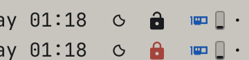
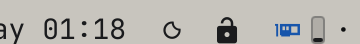
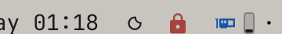

# Omalock

A one-click Omarchy bar widget that locks your window layout.



Click the lock glyph in the bar to toggle:

- **Locked** (`󰌾`): moving, resizing, swapping, floating, grouping, and
  sending windows to other workspaces are all disabled.
- **Unlocked** (`󰌿`): normal Hyprland window management.

## Installation

From the Omarchy marketplace or directly from git:

```bash
omarchy plugin add https://github.com/hjanuschka/omalock --enable
```

Then place the widget where you want it (for example the bar center):

```bash
omarchy plugin enable omalock center
omarchy restart shell
```

## Removal

```bash
omarchy plugin disable omalock
omarchy plugin remove omalock
```

Removing the plugin leaves no residual keybind changes: if the layout is
locked when you remove it, run `bin/omalock unlock` (or `hyprctl reload`)
first to restore the stock binds. The only state written is the marker file
at `${XDG_STATE_HOME:-~/.local/state}/omalock/state`, safe to delete.

## Dependencies

All are part of a standard Omarchy install:

- `hyprctl` (Hyprland) for the runtime `eval`/`reload` bind changes
- `jq` to read the active workspace id
- `omarchy-notification-send` (optional) for the lock/unlock toast

## How it works

Locking calls `hyprctl eval "hl.unbind(...)"` at runtime for every keybind
and mouse bind that mutates window geometry or placement (see `bin/omalock`
for the exact list). Unlocking runs `hyprctl reload`, which restores the full
config from `~/.config/hypr/`.

The lock is global: while active it applies to every workspace, so you cannot
move or resize windows on any workspace, nor move windows between them. State
is stored in `${XDG_STATE_HOME:-~/.local/state}/omalock/state`.

## CLI

```bash
bin/omalock lock      # lock
bin/omalock unlock    # unlock
bin/omalock toggle    # toggle
bin/omalock status    # prints "locked" or "unlocked"
```

## Screenshots

Unlocked (open padlock) vs locked (red padlock):




On a workspace with a tiled layout, locking freezes every window in place.

## Notes

- Focus, workspace switching, and fullscreen are intentionally left enabled.
- Custom move/resize keybinds added outside the stock Omarchy set are not
  covered; add their combos to `combos()` in `bin/omalock`.
